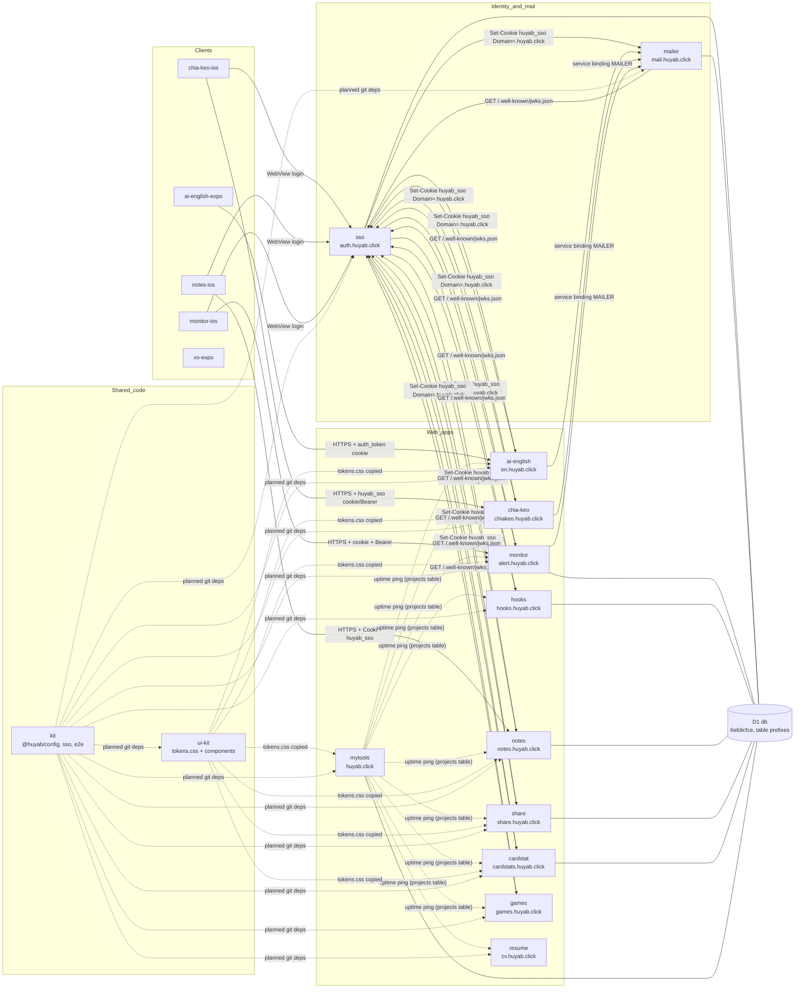

# huyab.click ecosystem map

How the repos under `personal-projects/` relate to each other: who calls whom, which
contracts they share, and where `kit` fits. Every relationship cites the file that
proves it (paths are relative to `personal-projects/`). Snapshot taken 2026-10-03; when
a cited file changes, update this map in the same change.

## 1. Overview

| Repo | Kind | Prod URL | Role |
| --- | --- | --- | --- |
| `sso` | worker | https://auth.huyab.click | Google OAuth, issues the domain-wide `huyab_sso` RS256 JWT, publishes JWKS (`sso/wrangler.jsonc`, `sso/AGENTS.md:5-8`) |
| `mailer` | worker | https://mail.huyab.click (log page only) | The only holder of `RESEND_API_KEY`; `POST /send` for other Workers via Service Binding (`mailer/AGENTS.md:5-9`) |
| `ai-english` | web (worker + SPA) | https://en.huyab.click | English learning app, AI tutor, streak-reminder cron (`ai-english/AGENTS.md:5-12`) |
| `ai-english-expo` | expo | — (EAS Update) | Mobile client of ai-english, no backend of its own (`ai-english-expo/AGENTS.md:5-7`) |
| `chia-keo` | web (worker + SPA) | https://chiakeo.huyab.click | Group expense splitting + payment QR, MCP endpoint (`chia-keo/AGENTS.md:5-9`, `chia-keo/wrangler.toml`) |
| `chia-keo-ios` | ios | — (sideloaded IPA) | Native SwiftUI client of chia-keo (`chia-keo-ios/AGENTS.md:5-8`) |
| `notes` | web (worker + SPA) | https://notes.huyab.click | Personal daily journal (`notes/AGENTS.md:5-7`) |
| `notes-ios` | ios | — (sideloaded IPA) | Native client of notes (`notes-ios/Notes/API.swift:149`) |
| `monitor` | web (worker + SPA) | https://alert.huyab.click | Odoo `ir.cron` lateness monitor, emails alerts (`monitor/AGENTS.md:5-10`) |
| `monitor-ios` | ios | — (sideloaded IPA) | Native client of monitor (`monitor-ios/Monitor/API.swift:96`) |
| `share` | web (worker + SPA) | https://share.huyab.click | Artifact hosting for AI agents, MCP + skill (`share/AGENTS.md:5-8`) |
| `cardstat` | web (Next.js on OpenNext worker) | https://cardstats.huyab.click | Card spending stats (`cardstat/wrangler.jsonc`) |
| `hooks` | worker (SSR HTML) | https://hooks.huyab.click | Webhook tester / inspector (`hooks/AGENTS.md:5-6`) |
| `games` | web (worker + static) | https://games.huyab.click (+ `pikachu.huyab.click` 301) | Multiplayer browser games on Durable Objects (`games/AGENTS.md:5-10`, `games/wrangler.toml`) |
| `mytools` | web (React Router SSR worker) | https://huyab.click, https://case.huyab.click | ToolHub; `/projects` showcase pings every app (`mytools/AGENTS.md:5-9`) |
| `resume` | web (static assets) | https://resume.huyab.click, https://cv.huyab.click | Static CV (`resume/AGENTS.md:5-8`) |
| `xo-expo` | expo | — (EAS Update) | Standalone tic-tac-toe, no backend (`xo-expo/AGENTS.md:5-8`) |
| `ui-kit` | lib (copy-paste) | — (gallery only, no deploy) | Source of truth for `--ui-*` design tokens + React components, copied into apps (`ui-kit/AGENTS.md:5-14`) |
| `dev-notes` | docs | — | Markdown notes on shared conventions and library choices (`dev-notes/AGENTS.md:5-8`) |
| `kit` | lib (pnpm workspace) | github:nguyenhuy158/kit | Shared code via git deps: `@huyab/config`, `@huyab/sso`, `@huyab/e2e`, reusable `check.yml` (this repo) |

Worker names differ from repo names in four places: `chia-keo` → `chiakeo`
(`chia-keo/wrangler.toml:1`), `hooks` → `webhook-tester` (`hooks/wrangler.jsonc`),
`mytools` → `case-converter` (`mytools/wrangler.jsonc`), `games` → `pikachu-online`
(`games/wrangler.toml:1`). Service bindings reference the **worker** name.

## 2. Graph

Solid arrows are runtime calls; dashed arrows are copied/planned code or passive
pings.



Edge sources:

| Edge | Evidence |
| --- | --- |
| sso issues `huyab_sso` on `.huyab.click` | `sso/wrangler.jsonc` (`COOKIE_DOMAIN`), `sso/src/env.ts:13`, `sso/docs/INTEGRATION.md:33-34` |
| apps fetch JWKS from sso | `ai-english/src/adapters/jose/ssoVerifier.js:5`, `chia-keo/worker/src/sso.ts:26`, `notes/worker/src/sso-verifier.js:20`, `monitor/server/src/index.ts:23`, `share/worker/src/sso-verifier.ts:14`, `cardstat/src/infrastructure/auth/sso-verifier.ts:26`, `hooks/src/adapters/outbound/security/sso-verifier.ts:30`, `games/worker/sso.js:13`, `mailer/src/sso.ts:21` |
| ai-english → mailer | `ai-english/wrangler.jsonc` (`services: MAILER → mailer`), `ai-english/src/adapters/mailer/mailerPort.js:11`, `ai-english/src/worker.js:72` |
| chia-keo → mailer | `chia-keo/wrangler.toml` (`[[services]] MAILER → mailer`), `chia-keo/worker/src/routes/email-summary.ts:64-67` |
| monitor → mailer | `monitor/wrangler.jsonc` (`services: MAILER → mailer`), `monitor/server/src/index.ts:54-60` |
| chia-keo-ios → chia-keo | `chia-keo-ios/ChiaKeo/API.swift:410`, `chia-keo-ios/ChiaKeo/Auth.swift:73-83`, server side `chia-keo/worker/src/sso.ts:62-68` |
| notes-ios → notes | `notes-ios/Notes/API.swift:149`, `notes-ios/Notes/API.swift:193-197` |
| monitor-ios → monitor | `monitor-ios/Monitor/API.swift:96`, `monitor-ios/Monitor/API.swift:133-135` |
| iOS WebView login → sso | `chia-keo-ios/ChiaKeo/LoginView.swift:4`, `notes-ios/Notes/LoginView.swift:4`, `monitor-ios/Monitor/LoginView.swift:4-6` |
| ai-english-expo → ai-english | `ai-english-expo/src/api.js:9`, `ai-english-expo/src/api.js:65`, `ai-english-expo/src/LoginScreen.js:18` |
| mytools pings every app | `mytools/app/routes/api.projects-status.tsx:1-8`, `mytools/app/data/projects.ts:1-7` (URLs live in D1 table `projects`) |
| shared D1 `db` (`6eb9cfce-…`) | `database_id` in `sso/`, `mailer/`, `monitor/`, `hooks/`, `notes/`, `share/`, `cardstat/`, `mytools/wrangler.jsonc` |
| ui-kit tokens copied | header comments in `ai-english/src/client/tokens.css:2`, `chia-keo/src/styles/tokens.css:2-3`, `notes/src/styles/tokens.css:19`, `monitor/client/src/styles/tokens.css:2`, `share/src/styles/tokens.css:2`, `cardstat/src/styles/tokens.css:17`, `mytools/app/styles/tokens.css:2-3` |
| kit planned / adopted | see section 5 for which file each package replaces; adopted so far (branch `chore/standardize`, unmerged): sso and mytools (`sso/package.json`, `mytools/package.json`, `sso/.github/workflows/ci.yml:17`, `mytools/.github/workflows/ci.yml:17`) |

## 3. Per-repo

Cloudflare account resources referenced below:

- **D1 `db`** (`6eb9cfce-f6f3-4476-8e46-7c8e954d93c1`): shared; every app prefixes its tables (`sso_`, `mailer_`, `monitor_`, `webhook_tester_`, `notes_`, `share_`, `cardstat_`). Sources: `sso/schema.sql:4`, `mailer/schema.sql:1`, `monitor/schema.sql:4`, `hooks/schema.sql:6`, `notes/schema.sql:3`, `share/schema.sql:4`, `cardstat/migrations/0001_init.sql:1`. Exception: `cardstat/migrations/0002_auth.sql:3-52` created unprefixed `user`/`session`/`account`/`verification` tables in the shared DB.
- **D1 `stitch-db`** (ai-english only), **D1 `chiakeo-db`** (chia-keo only).

### sso
- **Depends on:** Google OAuth (`sso/src/google.ts`); D1 `db` table `sso_users` (`sso/schema.sql:4`).
- **Depended on by:** every web app in section 2 and the three iOS apps (cookie + JWKS).
- **Auth:** is the issuer. Secrets `JWT_PRIVATE_KEY`, `GOOGLE_CLIENT_ID`, `GOOGLE_CLIENT_SECRET` (`sso/AGENTS.md:43-44`). Redirect allow-list `ALLOWED_REDIRECT_SUFFIX=.huyab.click`, TTL 86400 s (`sso/wrangler.jsonc`).
- **Data:** D1 `db` (`sso_` prefix).
- **Deploy:** `pnpm run deploy` (`sso/AGENTS.md:41`, `sso/README.md:35`); custom domain `auth.huyab.click`.
- **Ships for consumers:** `sso/docs/INTEGRATION.md` and `sso/README.md`, which point relying apps at `@huyab/sso` (`sso/docs/INTEGRATION.md:83-96`, `sso/README.md:59-73`). The old copy-paste `sso/scaffold/cloudflare-worker/` was deleted on `chore/standardize`.
- **kit:** `@huyab/config`, `@huyab/e2e` (`sso/package.json`), reusable `check.yml` (`sso/.github/workflows/ci.yml:17`). It does **not** use `@huyab/sso`: it signs and verifies its own tokens with the local key, with no JWKS fetch (`sso/AGENTS.md:15`).

### mailer
- **Depends on:** Resend API (`mailer/src/index.ts:246`); sso for the log page (`mailer/src/index.ts:203-214`, `mailer/src/sso.ts`).
- **Depended on by:** ai-english, chia-keo, monitor (service bindings, see section 2).
- **Auth:** `/send` = service binding + `Authorization: Bearer INTERNAL_API_KEY` (`mailer/src/index.ts:230-233`); `GET /` = `huyab_sso` with `email == ADMIN_EMAIL` (`mailer/wrangler.jsonc`, `mailer/src/index.ts:212`).
- **Data:** D1 `db`, table `mailer_sent_emails` (`mailer/schema.sql:1`).
- **Deploy:** Cloudflare Workers Builds on push to `main` (`mailer/AGENTS.md:47-48`).
- Note: the comment at `mailer/src/index.ts:226` says the Worker "has no route"; `mailer/wrangler.jsonc` does route `mail.huyab.click` (log page only). `/send` is still protected by the bearer.

### ai-english
- **Depends on:** sso (`ai-english/wrangler.jsonc` `SSO_ISSUER`/`SSO_AUDIENCE`, `ai-english/src/adapters/jose/ssoVerifier.js:5`); mailer via `MAILER` binding + secret `MAILER_KEY` (`ai-english/src/worker.js:72`); Workers AI `AI` (model in `MOCHI_MODEL`); cron `30 13 * * *` for streak reminders (`ai-english/wrangler.jsonc`, `ai-english/src/domain/usecases/sendStreakReminders.js`).
- **Depended on by:** ai-english-expo (`ai-english-expo/src/api.js:9`).
- **Auth:** `huyab_sso` is exchanged for a local `auth_token` cookie on `/api/auth/me` (`ai-english/src/adapters/http/router.js:392-398`); login goes `/api/auth/google` → sso (`router.js:383-386`); logout clears both via sso `/logout` (`router.js:415-425`).
- **Data:** D1 `stitch-db` (migrations `data/migrations`), R2 `ai-english-vocab` (`ai-english/wrangler.jsonc`).
- **Deploy:** Workers Builds on push to `main` (`ai-english/AGENTS.md:84`). Custom domain `en.huyab.click` is not declared in `wrangler.jsonc` [INFERENCE: attached in the dashboard], URL from `ai-english/AGENTS.md:5`.

### ai-english-expo
- **Depends on:** ai-english API `https://en.huyab.click` (`ai-english-expo/src/api.js:9`), login via WebView at `/api/auth/google` (`ai-english-expo/src/api.js:65`, `ai-english-expo/src/LoginScreen.js:18`).
- **Depended on by:** none.
- **Auth:** `auth_token` cookie shared from WebView into native cookie store (`ai-english-expo/AGENTS.md:9-13`).
- **Data:** none.
- **Deploy:** EAS Update (`ai-english-expo/app.json:32-33`).

### chia-keo
- **Depends on:** sso (`chia-keo/worker/src/sso.ts`, browser links in `chia-keo/src/adapters/browser/sso.ts:4-24`); mailer via `MAILER` + `MAILER_KEY` (`chia-keo/wrangler.toml`, `chia-keo/worker/src/env.ts:14`).
- **Depended on by:** chia-keo-ios (`chia-keo-ios/ChiaKeo/API.swift:410`); Claude MCP clients via `/api/mcp` (`chia-keo/worker/src/mcp/http.ts`, `chia-keo/src/components/McpTokenPanel.tsx:118`).
- **Auth:** better-auth session first, then `huyab_sso` cookie or `Authorization: Bearer <sso jwt>` (`chia-keo/worker/src/lib/require-user.ts:42-54`, `chia-keo/worker/src/sso.ts:62-68`); MCP uses its own bearer tokens.
- **Data:** D1 `chiakeo-db` via Drizzle (`chia-keo/wrangler.toml`).
- **Deploy:** Workers Builds on push to `main` (`chia-keo/AGENTS.md:271`).

### chia-keo-ios / notes-ios / monitor-ios
Same SwiftUI template, zero dependencies, same `Auth.swift` / `API.swift` / `LoginView.swift` / `make-ipa.sh` layout (`chia-keo-ios/AGENTS.md:10-13`).
- **Depends on:** sso WebView login, then the app API:
  - chia-keo-ios → `https://chiakeo.huyab.click`; installs `huyab_sso` in the cookie jar (`chia-keo-ios/ChiaKeo/Auth.swift:73-83`).
  - notes-ios → `https://notes.huyab.click`; sends `Cookie: huyab_sso=<token>` explicitly, cookie jar off (`notes-ios/Notes/API.swift:190-197`).
  - monitor-ios → `https://alert.huyab.click`; cookie jar + `Authorization: Bearer` (`monitor-ios/Monitor/API.swift:130-136`); server reads only the cookie (`monitor/server/src/index.ts:28-30`).
- **Depended on by:** none.
- **Data:** token in Keychain (`chia-keo-ios/ChiaKeo/Auth.swift:60-62`).
- **Deploy:** unsigned IPA via `make-ipa.sh`, signed with Sideloadly (`chia-keo-ios/AGENTS.md:54`, `notes-ios/AGENTS.md:51`, `monitor-ios/AGENTS.md:49`); CI `test.yml` on `macos-15`.

### notes
- **Depends on:** sso (`notes/wrangler.jsonc` `SSO_ISSUER`, `notes/worker/src/sso-verifier.js` = copy of the former `sso/scaffold`); Workers AI `AI`; R2 `notes-media` (`notes/wrangler.jsonc`).
- **Depended on by:** notes-ios.
- **Auth:** `huyab_sso` cookie only (`notes/worker/src/index.ts:181`, `notes-ios/Notes/API.swift:193-194`).
- **Data:** D1 `db` (`notes_` prefix), R2 `notes-media`.
- **Deploy:** Workers Builds on push to `main` (`notes/AGENTS.md:283`).

### monitor
- **Depends on:** sso (`monitor/wrangler.jsonc`, `monitor/server/src/index.ts:19-41`, uses `jose`); mailer via `MAILER` (`monitor/server/src/index.ts:54-60`); external Odoo instances over JSON-RPC (`monitor/server/src/odoo.ts:2`); cron `*/1 * * * *` (`monitor/wrangler.jsonc`).
- **Depended on by:** monitor-ios.
- **Auth:** `huyab_sso` cookie, `requireUser` sets `c.get("email")` (`monitor/server/src/index.ts:44-49`).
- **Data:** D1 `db` (`monitor_` prefix, `monitor/schema.sql`).
- **Deploy:** Cloudflare Git Integration on push; never `wrangler deploy` locally (`monitor/AGENTS.md:51-52`).

### share
- **Depends on:** sso (`share/wrangler.jsonc`, `share/worker/src/sso-verifier.ts`).
- **Depended on by:** AI agents via `share/mcp/index.mjs`, `share/scripts/share.sh`, `share/skills/share-artifact/SKILL.md` (all target `https://share.huyab.click`).
- **Auth:** `huyab_sso` cookie, or `Authorization: Bearer <master password>` + `X-Email` (`share/worker/src/index.ts:126-134`, `:341-350`).
- **Data:** D1 `db` (`share_` prefix, `share/schema.sql`).
- **Deploy:** `pnpm deploy` (build + `wrangler deploy`) (`share/AGENTS.md:36`); zone route `share.huyab.click/*`, not a custom domain (`share/wrangler.jsonc`).

### cardstat
- **Depends on:** sso (`cardstat/wrangler.jsonc` `SSO_ISSUER`, `cardstat/src/infrastructure/auth/sso-verifier.ts`).
- **Depended on by:** none (CLI helper `cardstat/scripts/cli-auth.mjs` reuses a copied cookie).
- **Auth:** `huyab_sso` cookie (`cardstat/src/infrastructure/auth/require-user.ts:22-34`).
- **Data:** D1 `db` (`cardstat_` prefix + unprefixed auth tables, see above).
- **Deploy:** Workers Builds on push to `main`; CI never deploys (`cardstat/AGENTS.md:74-75`, `cardstat/.github/workflows/ci.yml:8-17`).

### hooks
- **Depends on:** sso (`hooks/src/config/env.ts:36`, `hooks/src/adapters/outbound/security/sso-verifier.ts`); Durable Object `EndpointHub` (`hooks/wrangler.jsonc`).
- **Depended on by:** any external system posting to `https://hooks.huyab.click/hook/…` (`hooks/README.md:6`).
- **Auth:** local `access_token` cookie or `huyab_sso`, first-seen SSO users provisioned (`hooks/src/adapters/inbound/http/middleware.ts:19-40`).
- **Data:** D1 `db` (`webhook_tester_` prefix), DO `EndpointHub`.
- **Deploy:** Workers Builds on push to `main` (`hooks/AGENTS.md:62-63`).

### games
- **Depends on:** sso, optional sign-in for history (`games/worker/sso.js:1-13`, `games/public/me.js:9`, `:43`); Durable Objects `Room`, `Top`, `MinerRoom`, `MineRoom`, `DiceRoom`, `CaroRoom`, `ShipRoom`, `NokiaRoom` (`games/wrangler.toml`).
- **Depended on by:** none.
- **Auth:** `huyab_sso` cookie (optional).
- **Data:** DO SQLite only (no D1: "goi free da het quota D1", `games/wrangler.toml`).
- **Deploy:** Workers Builds (`games/AGENTS.md:74`); CI waits for `/api/version` then smokes prod (`games/.github/workflows/ci.yml:71-95`).

### mytools
- **Depends on:** D1 `db` (`projects` table) (`mytools/app/data/projects.ts:1-7`); KV `KV_GAMES`, `NOTES`; DOs `LotoGameRoom`, `OnlineCounter` (`mytools/wrangler.jsonc`); external Odoo JSON-RPC (`mytools/app/utils/odoo.ts:49`).
- **Depended on by:** none. It pings every app listed in `projects` (`mytools/app/routes/api.projects-status.tsx`).
- **Auth:** none (no SSO usage found in `mytools/app` or `mytools/workers`).
- **kit:** `@huyab/config`, `@huyab/e2e` (`mytools/package.json`), reusable `check.yml` plus its own unit-test job for D1 secrets (`mytools/.github/workflows/ci.yml:17`).
- **Data:** D1 `db`, two KV namespaces, DO SQLite.
- **Deploy:** Workers Builds on push to `main` (`mytools/AGENTS.md:121`).

### resume
- **Depends on:** nothing (static `public/index.html`, Tailwind CDN) (`resume/AGENTS.md:5-8`).
- **Deploy:** Workers Builds on push to `main` (`resume/AGENTS.md:41-42`).

### xo-expo
- **Depends on:** nothing (no backend, `xo-expo/AGENTS.md:5-8`). **Deploy:** EAS Update (`xo-expo/app.json:36-37`).

### ui-kit
- **Depends on:** nothing at runtime. **Depended on by:** copies in ai-english, chia-keo, notes, monitor, share, cardstat, mytools (section 2). **Deploy:** none (`ui-kit/AGENTS.md:65`).

### dev-notes
- Docs only (`dev-notes/AGENTS.md:5-8`). Conventions in `dev-notes/conventions.md`.

### kit
- **Depends on:** nothing. **Depended on by:** sso and mytools (adopted on `chore/standardize`), planned for every other TS/JS repo (section 5). **Deploy:** git tags (`v0.1.0`), consumed as `pnpm add "github:nguyenhuy158/kit#v0.1.0&path:packages/<name>"`.

## 4. Shared contracts

### 4.1 `huyab_sso` cookie / JWT

| Item | Value | Source |
| --- | --- | --- |
| Issuer | `https://auth.huyab.click` | `sso/wrangler.jsonc` (`ISSUER`) |
| Cookie | `huyab_sso`, `Domain=.huyab.click`, HttpOnly, Secure, SameSite=Lax | `sso/src/env.ts:13`, `sso/AGENTS.md:64`, `sso/wrangler.jsonc` (`COOKIE_DOMAIN`) |
| Algorithm | RS256; private key only in sso | `sso/src/jwt.ts:5`, `sso/AGENTS.md:65` |
| JWKS | `https://auth.huyab.click/.well-known/jwks.json` | `sso/src/index.ts:92`, `sso/docs/INTEGRATION.md:42` |
| Claims | `iss`, `sub` (stable numeric string, key users on it), `aud` = `huyab.click`, `email`, `name`, `picture`, `iat`, `exp` | `sso/docs/INTEGRATION.md:53-67` |
| Lifetime | 24 h (`SESSION_TTL_SECONDS=86400`) | `sso/wrangler.jsonc` |
| Login | `GET /login?redirect_uri=<https URL under .huyab.click>` | `sso/docs/INTEGRATION.md:40`, `:45-46` |
| Logout | `GET /logout?redirect_uri=…` (only the issuer can clear the cookie) | `sso/docs/INTEGRATION.md:41`, `:209-219` |
| Session JSON | `GET /me` (server-side only, no CORS) | `sso/docs/INTEGRATION.md:43`, `:193-207` |
| Required checks | RS256 signature vs JWKS, `iss`, `exp`; cache the key | `sso/docs/INTEGRATION.md:71-79` |
| Optional checks | `aud == "huyab.click"` (enforced by mailer and ai-english only) | `mailer/src/sso.ts:5`, `:72`, `ai-english/wrangler.jsonc` (`SSO_AUDIENCE`) |
| Non-browser transport | `Authorization: Bearer <same JWT>` (chia-keo only today) | `chia-keo/worker/src/sso.ts:62-68` |

Changing claims, cookie attributes or JWKS shape is breaking for every app
(`sso/AGENTS.md:99-102`). `@huyab/sso` implements this contract. Core, without Hono:
`import { verifySsoToken, getClaimsFromRequest, readSsoToken, ssoUrl, SSO_COOKIE, DEFAULT_SSO_ISSUER } from "@huyab/sso"`
(reads the cookie, then `Bearer`). Hono middleware lives on a subpath so non-Hono apps
(cardstat/Next.js) don't pull in Hono: `import { requireUser, type SsoVariables } from "@huyab/sso/hono"`.
`requireUser` reads the issuer from the `SSO_ISSUER` binding (fallback `https://auth.huyab.click`),
sets `c.get("user")` to the `SsoClaims`, and returns `401 {"error":"unauthorized"}` otherwise.

### 4.2 mailer `POST /send`

Called only through a Cloudflare Service Binding, never over the public internet.

```jsonc
// wrangler (caller)
"services": [{ "binding": "MAILER", "service": "mailer" }]
// secret on caller: MAILER_KEY == mailer's INTERNAL_API_KEY
```

```http
POST https://mailer/send            (host is ignored by service bindings)
Authorization: Bearer <MAILER_KEY>
Content-Type: application/json

{ "to": "a@x.com" | ["a@x.com"], "subject": "…", "html": "…" | "text": "…",
  "from"?: "…" (default DEFAULT_FROM=noreply@huyab.click), "replyTo"?: "…" }
```

| Response | Meaning |
| --- | --- |
| `200 { "id": "<resend id>" }` | sent, logged in `mailer_sent_emails` |
| `401 { "error": "unauthorized" }` | missing/wrong bearer |
| `400 { "error": "invalid_json" }` / `{ "error": "expected { to, subject, html\|text }" }` | bad body |
| `502 { "error": "send_failed", "detail": … }` | Resend rejected; logged as `failed` |

Sources: `mailer/src/index.ts:180-195` (body type and validator), `mailer/src/index.ts:230-280`
(handler), `mailer/wrangler.jsonc` (`DEFAULT_FROM`), `chia-keo/wrangler.toml` (binding +
`MAILER_KEY` note). Reference callers: `ai-english/src/adapters/mailer/mailerPort.js`,
`monitor/server/src/index.ts:54-60`, `chia-keo/worker/src/routes/email-summary.ts:64`.

### 4.3 Design tokens

- Source of truth: `ui-kit/src/styles/tokens.css` (`ui-kit/AGENTS.md:12`).
- Fixed names: `--ui-bg`, `--ui-surface`, `--ui-surface-muted`, `--ui-fg`, `--ui-fg-muted`,
  `--ui-border`, `--ui-ring`, `--ui-primary`, `--ui-primary-hover`, `--ui-primary-fg`,
  `--ui-primary-soft`, `--ui-success(-soft)`, `--ui-warning(-soft)`, `--ui-danger(-soft)`,
  `--ui-radius`, exposed to Tailwind v4 through `@theme inline`
  (`ui-kit/src/styles/tokens.css:7-10`, `:89`).
- Dark mode: class `.dark` on `<html>` (`ui-kit/src/styles/tokens.css:17-18`, `:58`).
- Rule: apps change **values** in `:root` / `.dark` only, never names; components use
  semantic classes (`bg-primary`, `text-fg-muted`, `rounded-ui`) (`ui-kit/README.md:59-72`,
  `chia-keo/AGENTS.md:136-140`).
- Copies: verbatim in ai-english (`ai-english/AGENTS.md:123`), monitor (`monitor/AGENTS.md:19`),
  share (`share/AGENTS.md:14`); re-valued in chia-keo, notes, cardstat, mytools (header
  comments cited in section 2). notes also generates `--ui-primary` at runtime
  (`notes/src/accentColor.ts:40-46`).

Tokens stay copy-paste for now (ui-kit is intentionally not a package,
`ui-kit/README.md:4`); they are not part of kit `v0.1.0`.

### 4.4 E2E: production is read-only

- Every deployed repo has `pnpm e2e` (local `wrangler dev`) and `pnpm e2e:prod`; the prod
  suite is GET-only, logged out, never writes (`sso/AGENTS.md:81-84`, `mailer/AGENTS.md:69-70`,
  `hooks/AGENTS.md:96-98`, `chia-keo/AGENTS.md:175`, `notes/AGENTS.md:58`,
  `share/AGENTS.md:56`, `monitor/AGENTS.md:84-85`, `mytools/AGENTS.md:103-106`,
  `cardstat/AGENTS.md:105`, `resume/AGENTS.md:58-59`, `games/AGENTS.md:107`).
- Write suites hard-fail on an `https://` base URL: `mailer/e2e/dev-smoke.mjs:6`,
  `hooks/e2e/dev-smoke.mjs:6`. `@huyab/e2e` exports this as `assertLocalOnly(baseUrl)`.
- Local logged-in suites mint their own tokens / fake JWKS instead of touching the real
  sso (`sso/AGENTS.md:76-80`, `notes/e2e/sso-mock.mjs`, `share/e2e/sso-mock.mjs`,
  `cardstat/.github/workflows/ci.yml:112`).

## 5. kit packages: what they replace

| Package | Replaces (copies today) |
| --- | --- |
| `@huyab/sso` | the former `sso/scaffold/cloudflare-worker/sso-verifier.js` + `session.js` (deleted on sso `chore/standardize`) and its copies: `notes/worker/src/sso-verifier.js`, `share/worker/src/sso-verifier.ts`, `cardstat/src/infrastructure/auth/sso-verifier.ts`, `hooks/src/adapters/outbound/security/sso-verifier.ts`, `mailer/src/sso.ts`, `chia-keo/worker/src/sso.ts`, `games/worker/sso.js`; `jose`-based variants in `monitor/server/src/index.ts:19-41`, `ai-english/src/adapters/jose/ssoVerifier.js` |
| `@huyab/e2e` | `e2e/chromium.mjs` (ai-english, cardstat, chia-keo, monitor, notes, games, share, ui-kit; already removed from mytools and sso), `e2e/harness.mjs` (hooks, mailer, resume), server start/stop in each `e2e/run.mjs` |
| `@huyab/config` | per-repo `biome.json` (ai-english, ai-english-expo, chia-keo, hooks, mailer, monitor, mytools, notes, games, share, sso, ui-kit, xo-expo) and `tsconfig.json` strict settings |
| `kit/.github/workflows/check.yml` | per-repo `.github/workflows/ci.yml` lint/check/build/e2e jobs |

## 6. How to add a new app

1. **Name & domain.** Pick `<app>.huyab.click`. In `wrangler.jsonc` set `"workers_dev": false`
   and `"routes": [{ "pattern": "<app>.huyab.click", "custom_domain": true }]`
   (pattern: `notes/wrangler.jsonc`).
2. **Scaffold tooling from kit.** `pnpm add -D "github:nguyenhuy158/kit#v0.1.0&path:packages/config"`;
   `biome.json` → `{ "extends": ["@huyab/config/biome.json"] }`; `tsconfig.json` extends
   `@huyab/config/tsconfig.base.json`. `.nvmrc` = `22`, pin `packageManager` pnpm.
3. **Auth.** Add `"vars": { "SSO_ISSUER": "https://auth.huyab.click" }`; install `@huyab/sso`
   and guard Hono routes with `requireUser` from `@huyab/sso/hono` (non-Hono: call
   `getClaimsFromRequest` from `@huyab/sso`). Key users on `sub`, not email
   (`sso/docs/INTEGRATION.md:221-235`). Keep webhooks/health public. Logout must redirect
   to `${SSO_ISSUER}/logout?redirect_uri=…`. No change in `sso` is needed: any https host
   under `.huyab.click` is an allowed redirect.
4. **Data.** Either a dedicated D1, or the shared `db` with a unique `<app>_` table prefix
   and create-only schema (never `DROP`) (`mailer/AGENTS.md:29-30`). Need more capacity
   than free D1 → DO SQLite like `games`.
5. **Email.** Never hold `RESEND_API_KEY`. Add `"services": [{ "binding": "MAILER", "service": "mailer" }]`,
   `wrangler secret put MAILER_KEY` (= mailer's `INTERNAL_API_KEY`), call `POST /send` per 4.2.
6. **UI.** Copy `ui-kit/src/styles/tokens.css` + needed components; change token values,
   never names (4.3).
7. **E2E.** Add `e2e/run.mjs` using `@huyab/e2e` (`run`, `startServer`, `freePort`, `findChromium`,
   `startSsoMock`, harness `BASE`/`test`/`assert`/`request`/`expectStatus`/`finish`);
   `readonly-smoke.mjs` GET-only for `pnpm e2e:prod`; any writing suite calls
   `assertLocalOnly(baseUrl)` first (4.4).
8. **CI.** `.github/workflows/ci.yml` calls
   `nguyenhuy158/kit/.github/workflows/check.yml@v0.1.0` with `run-test` / `run-build` /
   `run-e2e`. Deploy stays in Cloudflare Workers Builds (connect the repo in the dashboard);
   CI never runs `wrangler deploy` (`cardstat/.github/workflows/ci.yml:8-17`).
9. **Native client (optional).** iOS: copy the `*-ios` template (`Auth.swift`, `API.swift`,
   `LoginView.swift`, `make-ipa.sh`) and set `ApiClient.origin` + `appHost`. Expo: copy
   `ai-english-expo/src/api.js` + `LoginScreen.js` pattern.
10. **Register.** Insert a row in the shared D1 `projects` table so mytools lists and pings it
    (`mytools/app/data/projects.ts:1-7`), add `AGENTS.md`, and add the app to this file
    (overview row, graph node, per-repo section).
